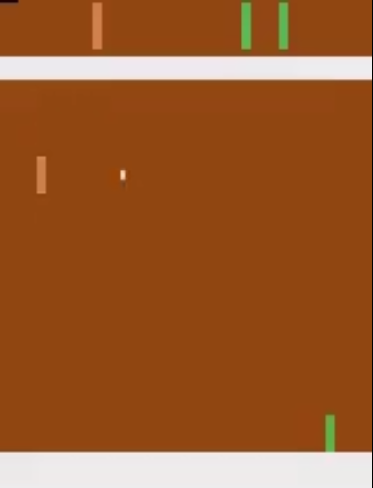
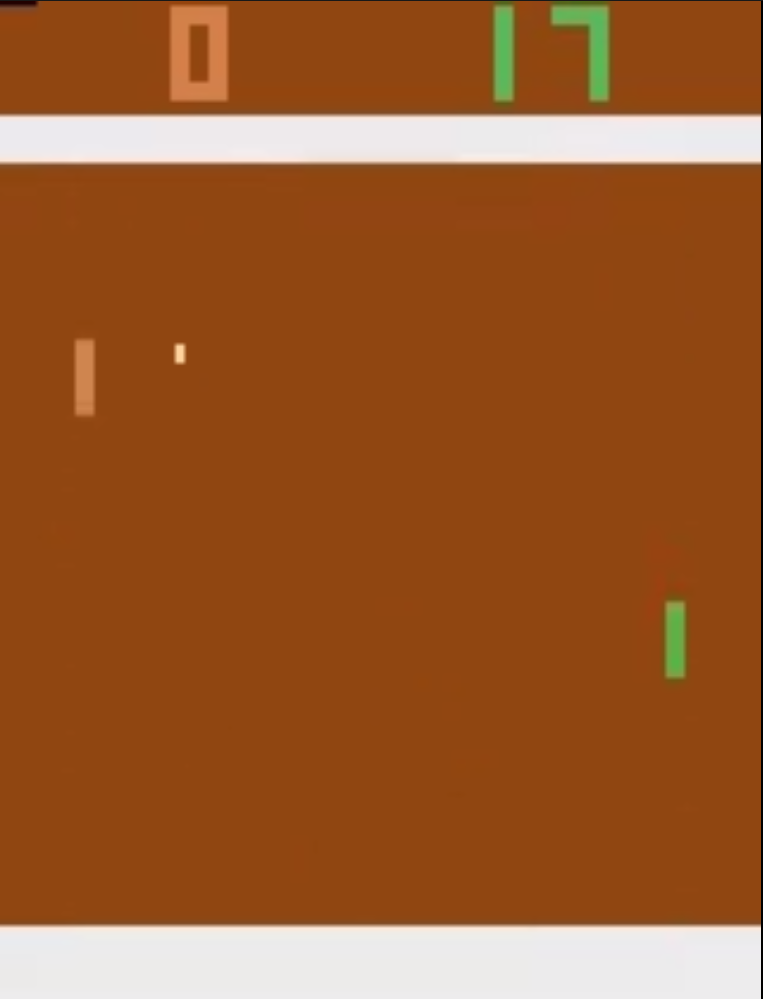
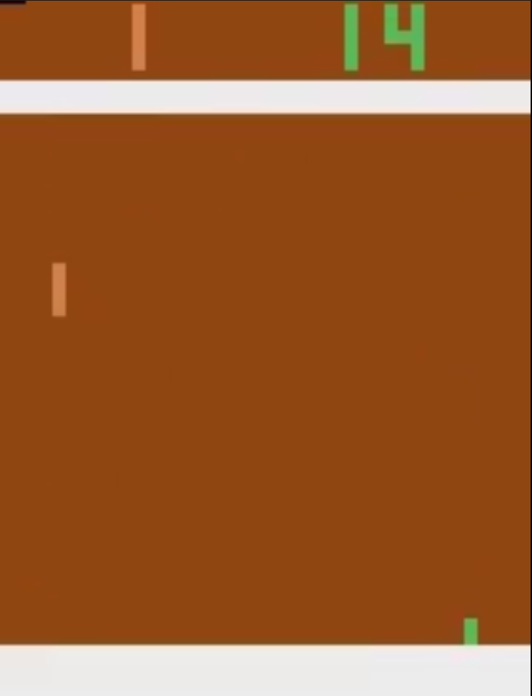
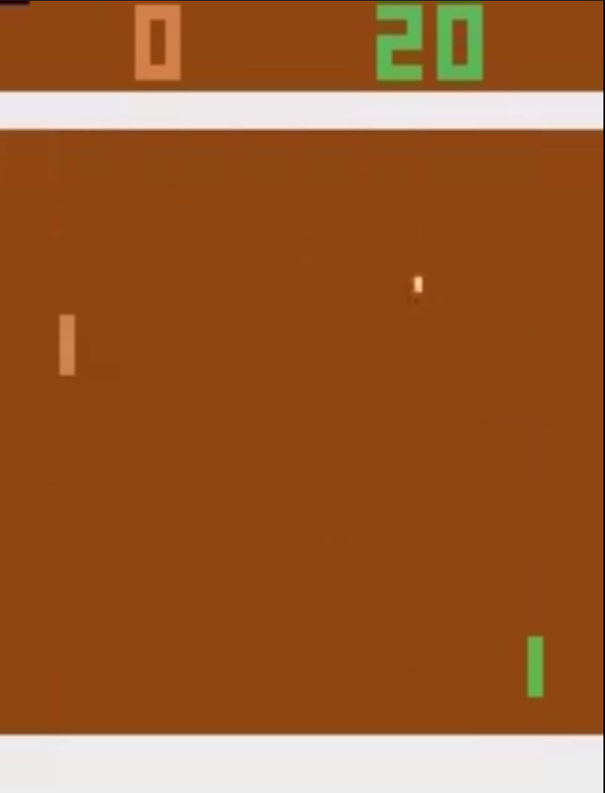
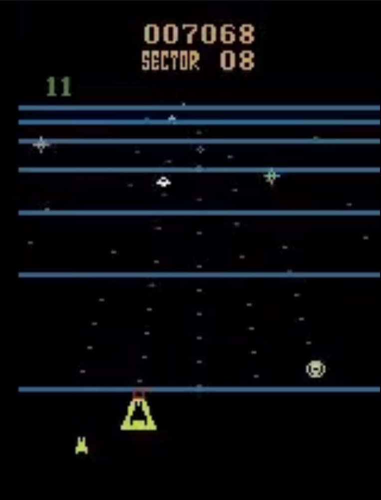
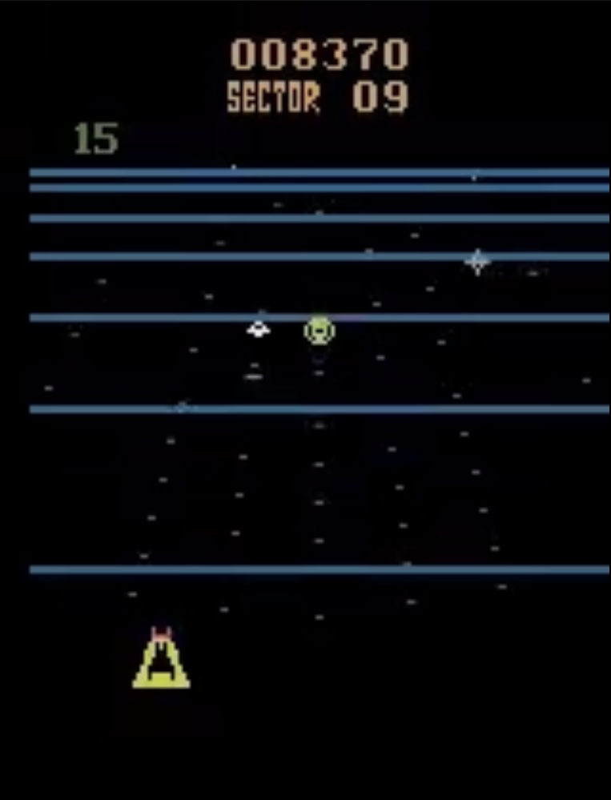
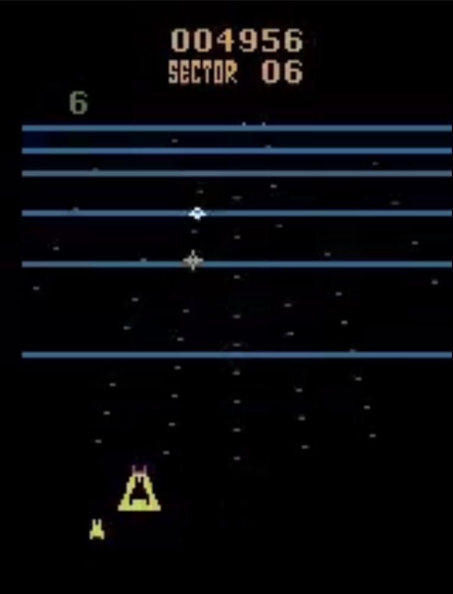
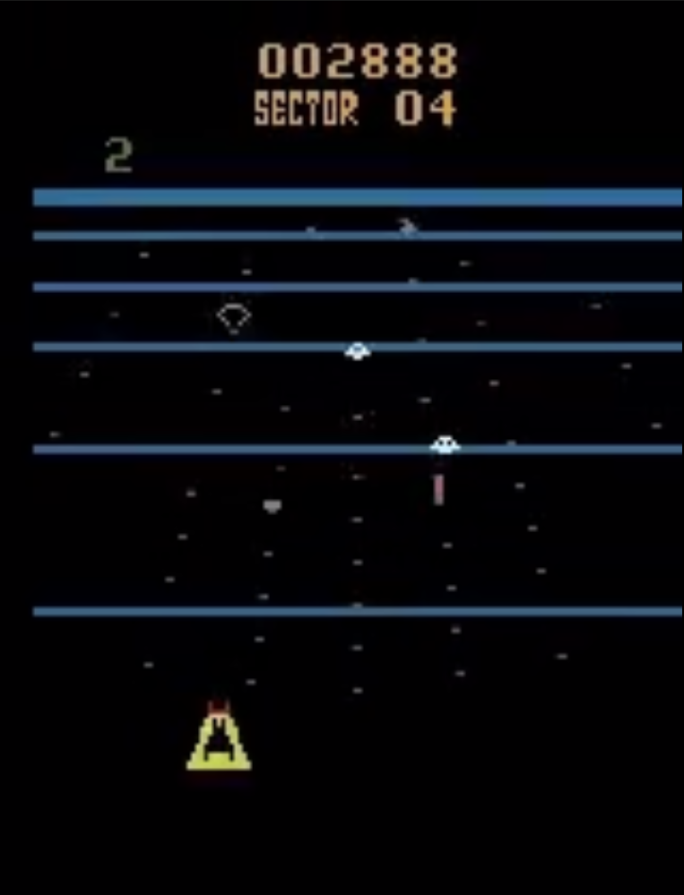
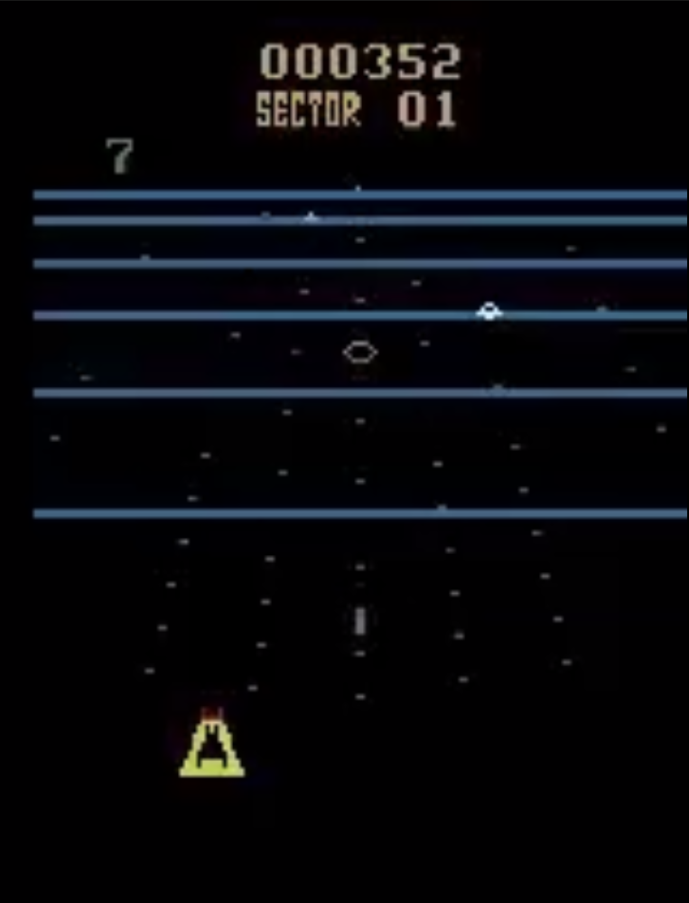

# Deep Reinforcement Learning for Atari Games: Pong and BeamRider

This project implements and compares **five state-of-the-art Deep Reinforcement Learning algorithms** on Atari games using Stable-Baselines3 and Gymnasium. The study provides a comprehensive comparison between value-based and policy-based methods across two games with different complexity levels.

## 🎮 Games

- **Pong** - Reflex-based game with simpler dynamics (perfect score: 21)
- **BeamRider** - Strategic shooting game with complex dynamics (high scores possible)

## 🤖 Algorithms Implemented

### Value-Based Algorithms (Off-Policy)
- **DQN** (Deep Q-Network) - Classic value-based method with experience replay
- **QRDQN** (Quantile Regression DQN) - Distributional RL that learns full return distributions

### Policy-Based Algorithms (On-Policy)
- **A2C** (Advantage Actor-Critic) - Synchronous version of A3C with parallel environments
- **PPO** (Proximal Policy Optimization) - Stable policy gradient method with clipping
- **RecurrentPPO** - PPO with LSTM for temporal dependencies

## 📊 Results Summary

### Pong Performance
All algorithms achieved near-perfect performance on Pong, demonstrating that this simpler game is well-solved by modern RL methods:

| Algorithm | Mean Reward | Std Dev |
|-----------|-------------|---------|
| **QRDQN** | **21.00** | 0.00 |
| DQN | 20.80 | 0.40 |
| PPO | 20.80 | 0.40 |
| A2C | 20.10 | 0.70 |
| RecurrentPPO | 19.80 | 0.87 |

### BeamRider Performance
Value-based methods significantly outperformed policy-based methods on the more complex BeamRider environment:

| Algorithm | Mean Reward | Std Dev |
|-----------|-------------|---------|
| **QRDQN** | **7686.40** | 3144.12 |
| DQN | 6122.20 | 1528.20 |
| A2C | 4158.00 | 1575.38 |
| PPO | 2024.40 | 676.31 |
| RecurrentPPO | 400.40 | 135.55 |

### Key Findings
- **Value-based methods excel** on complex games (BeamRider) with QRDQN achieving the best performance
- **Policy-based methods are competitive** on simpler games (Pong) but struggle on complex tasks
- **QRDQN shows promise** but exhibits higher variance, likely due to distributional learning
- **RecurrentPPO underperformed**, suggesting that frame stacking may be sufficient for temporal information

## 🎬 Gameplay Screenshots

### Pong Gameplay

#### Value-Based Algorithms

<table>
<tr>
<td align="center"><b>DQN</b><br></td>
<td align="center"><b>QRDQN</b><br></td>
</tr>
</table>

#### Policy-Based Algorithms

<table>
<tr>
<td align="center"><b>A2C</b><br></td>
<td align="center"><b>PPO</b><br></td>
<td align="center"><b>RecurrentPPO</b><br></td>
</tr>
</table>

### BeamRider Gameplay

#### Value-Based Algorithms

<table>
<tr>
<td align="center"><b>DQN</b><br></td>
<td align="center"><b>QRDQN</b><br></td>
</tr>
</table>

#### Policy-Based Algorithms

<table>
<tr>
<td align="center"><b>A2C</b><br></td>
<td align="center"><b>PPO</b><br></td>
<td align="center"><b>RecurrentPPO</b><br></td>
</tr>
</table>

## 📁 Project Structure

```
CS551-RL-PlayingAtari/
├── scripts/
│   ├── train.py          # Main training script (supports all 5 algorithms)
│   ├── evaluate.py       # Model evaluation and video recording
│   ├── plot_results.py   # Comprehensive visualization utilities
│   └── test_setup.py     # Setup verification
├── slurm_jobs/
│   ├── train_*.sh        # SLURM job scripts for Turing cluster
│   ├── submit_all_pong.sh
│   └── submit_all_beamrider.sh
├── logs/                 # TensorBoard logs for all experiments
├── models/               # Saved model checkpoints
├── videos/               # Gameplay recordings from evaluation
├── results/              # Plots, evaluation results, and analysis
│   ├── *_learning_curves_all.png
│   ├── final_performance_*.png
│   ├── performance_heatmap.png
│   ├── algorithm_type_comparison.png
│   └── sample_efficiency_*.png
├── images/               # Screenshots from evaluation videos
├── materials/            # Project documentation
│   ├── SETUP_INSTRUCTIONS.md
│   └── Algorithm_Selection_QRDQN_TRPO.md
└── requirements.txt
```

## 🚀 Quick Start

### Local Testing

```bash
# Activate virtual environment
source /home/vickinez_077/WPI\ FALL\ 2025/RL/venvrl/bin/activate

# Test setup
python scripts/test_setup.py

# Quick training test (local)
python scripts/train.py --algo dqn --game pong --steps 10000 --seed 0
```

### Training on Turing Cluster

See `materials/SETUP_INSTRUCTIONS.md` for detailed setup steps.

Quick commands:
```bash
# Submit all Pong training jobs
bash slurm_jobs/submit_all_pong.sh

# Submit all BeamRider training jobs
bash slurm_jobs/submit_all_beamrider.sh

# Monitor jobs
squeue -u $USER

# Check logs
tail -f logs/slurm_dqn_pong_*.out
```

## 💻 Usage Examples

### Train a Model

```bash
# Train DQN on Pong for 5M steps
python scripts/train.py --algo dqn --game pong --steps 5000000 --seed 0

# Train QRDQN on BeamRider
python scripts/train.py --algo qrdqn --game beamrider --steps 5000000 --seed 0

# Train PPO on Pong
python scripts/train.py --algo ppo --game pong --steps 5000000 --seed 0

# Train RecurrentPPO (alternative: --algo rppo)
python scripts/train.py --algo recurrentppo --game beamrider --steps 5000000 --seed 0
```

### Evaluate a Trained Model

```bash
# Evaluate and record videos
python scripts/evaluate.py \
    --model models/ppo_pong_seed0_final.zip \
    --game pong \
    --episodes 10 \
    --record

# Evaluate without recording
python scripts/evaluate.py \
    --model models/qrdqn_beamrider_seed0_final.zip \
    --game beamrider \
    --episodes 10
```

### Generate Comparison Plots

```bash
# Generate all plots (learning curves, bar charts, heatmaps, etc.)
python scripts/plot_results.py --mode all

# Generate only learning curves
python scripts/plot_results.py --mode learning_curves
```

## 🔬 Experimental Setup

### Training Configuration
- **Total Timesteps**: 5,000,000 per algorithm
- **Environments**: 
  - DQN/QRDQN: 1 environment (off-policy with replay buffer)
  - A2C: 16 parallel environments
  - PPO/RecurrentPPO: 8 parallel environments
- **Frame Stacking**: 4 frames (temporal information)
- **Evaluation**: 10 episodes per model
- **Seed**: 0 (for reproducibility)

### Hyperparameters
Each algorithm uses carefully tuned hyperparameters based on Stable-Baselines3 RL Zoo standards:
- **DQN**: Learning rate 1e-4, buffer size 500K, exploration fraction 0.5
- **QRDQN**: Similar to DQN, learns quantile distribution
- **A2C**: Learning rate 7e-4, n_steps=5, 16 parallel envs
- **PPO**: Learning rate 2.5e-4, n_steps=128, batch_size=256, clip_range=0.1
- **RecurrentPPO**: Similar to PPO but with LSTM policy, batch_size=128

## 📈 Visualization

The project includes comprehensive visualization tools that generate:

1. **Learning Curves** - Training progress over time for all algorithms
2. **Final Performance Bar Charts** - Comparison of final performance per game
3. **Performance Heatmap** - Algorithm vs. game performance matrix
4. **Algorithm Type Comparison** - Value-based vs. policy-based analysis
5. **Sample Efficiency Plots** - Steps needed to reach performance thresholds

All plots use consistent color schemes and are saved in the `results/` directory.

## 🔍 Analysis

### Value-Based vs. Policy-Based
- **Value-based methods** (DQN, QRDQN) leverage experience replay and learn Q-values, making them sample-efficient and effective for complex games
- **Policy-based methods** (A2C, PPO, RecurrentPPO) learn policies directly and are more stable but require more samples

### Game Complexity Impact
- **Pong**: Simple enough that all algorithms converge to near-optimal performance
- **BeamRider**: Complex enough to reveal significant performance differences between algorithms

### Distributional RL (QRDQN)
QRDQN learns the full return distribution rather than just the mean, providing richer information about uncertainty and risk. This appears beneficial for complex games but comes with higher variance.

## 📚 References

1. Mnih et al. (2013). Playing Atari with Deep Reinforcement Learning. arXiv:1312.5602
2. Mnih et al. (2015). Human-level control through deep reinforcement learning. Nature 518
3. Schulman, J. et al. (2017). Proximal Policy Optimization Algorithms. arXiv:1707.06347
4. Dabney et al. (2018). Distributional Reinforcement Learning with Quantile Regression. AAAI
5. Van Hasselt, H. et al. (2016). Deep Reinforcement Learning with Double Q-learning. AAAI

## 🔗 Links

- [Stable-Baselines3](https://github.com/DLR-RM/stable-baselines3)
- [SB3-Contrib](https://github.com/Stable-Baselines-Team/stable-baselines3-contrib)
- [Gymnasium](https://gymnasium.farama.org/)
- [SB3 RL Zoo](https://github.com/DLR-RM/rl-baselines3-zoo)

## 📝 Notes

- All models were trained on the Turing cluster at WPI
- Evaluation was performed locally with 10 episodes per model
- Videos and screenshots were captured during evaluation runs
- TensorBoard logs are available in the `logs/` directory for detailed training analysis

## 🎯 Future Work

- Hyperparameter tuning for underperforming algorithms (especially RecurrentPPO)
- Multiple seed runs for statistical significance
- Extended training (10M+ timesteps) for better convergence
- Additional algorithms (Rainbow DQN, IMPALA, etc.)
- More Atari games for broader comparison

---

**Project for CS551 - Reinforcement Learning (Fall 2025) - WPI**
